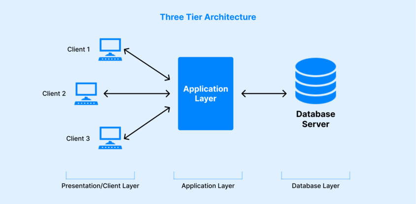
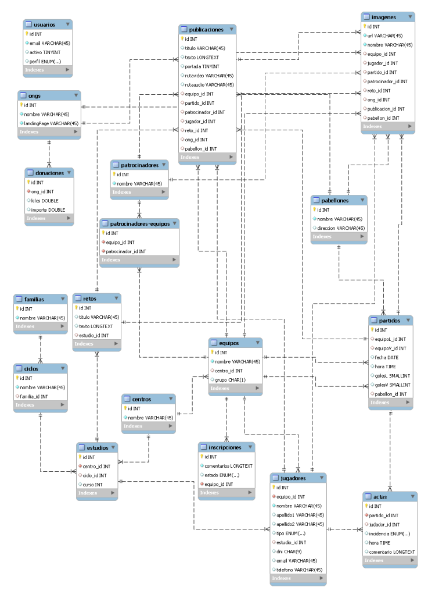
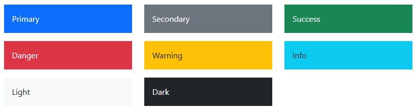

# Documentación del proyecto

## Índice

- [Documentación del proyecto](#documentación-del-proyecto)
  - [Índice](#índice)
  - [Miembros del equipo](#miembros-del-equipo)
  - [Introducción](#introducción)
  - [Entorno de desarrollo](#entorno-de-desarrollo)
  - [Base de datos](#base-de-datos)
  - [PHP](#php)
    - [.ENV](#env)
    - [Librerías](#librerías)
      - [Spatie](#spatie)
      - [Sanctum](#sanctum)
      - [Swagger](#swagger)
    - [Modelos](#modelos)
    - [Controladores](#controladores)
  - [JavaScript](#javascript)
  - [Bootstrap y CSS](#bootstrap-y-css)
    - [Paleta de colores](#paleta-de-colores)
    - [Diseño](#diseño)
    - [Uso de Bootstrap](#uso-de-bootstrap)
      - [Componentes utilizados](#componentes-utilizados)
        - [Breadcrumb (Migas de pan)](#breadcrumb-migas-de-pan)
        - [Buttons (Botones)](#buttons-botones)
        - [Cards (Tarjetas)](#cards-tarjetas)
        - [Navbar (Barra de navegación)](#navbar-barra-de-navegación)
        - [Modals (Modales)](#modals-modales)
        - [Pagination (Paginación)](#pagination-paginación)
    - [Responsividad](#responsividad)
    - [Accesibilidad](#accesibilidad)
    - [Animaciones](#animaciones)
  - [Despliegue de la aplicación](#despliegue-de-la-aplicación)
    - [AWS](#aws)
    - [Instalación Apache2](#instalación-apache2)
    - [Instalación de MySQL](#instalación-de-mysql)
    - [Instalación de PHP y librerías](#instalación-de-php-y-librerías)
      - [Configuración de PHP](#configuración-de-php)
    - [Habilitar PHP sobre Apache2](#habilitar-php-sobre-apache2)
    - [Instalar phpMyAdmin](#instalar-phpmyadmin)
    - [Instalar Composer](#instalar-composer)
    - [Instalar NodeJS](#instalar-nodejs)
      - [Desinstalar versión pre-instalada](#desinstalar-versión-pre-instalada)
      - [Instalar versión XX](#instalar-versión-xx)
    - [Crear sitio web](#crear-sitio-web)
    - [Script de despliegue](#script-de-despliegue)
  - [Documentación de código](#documentación-de-código)
    - [Generación de documentación](#generación-de-documentación)
  - [Implementaciones faltantes](#implementaciones-faltantes)
  - [Mejoras o posibles cambios a futuro](#mejoras-o-posibles-cambios-a-futuro)
  - [Problemas encontrados](#problemas-encontrados)
  - [Bibliografía y Webgrafía](#bibliografía-y-webgrafía)
    - [Bibliografía](#bibliografía)
    - [Webgrafía](#webgrafía)

## Miembros del equipo

- [Pablo Mata](https://github.com/pmatag01)
- [Álvaro Berodia](https://github.com/Isalvan)
- [Rodrigo Ruiz](https://github.com/Rodroq)
- [David Llanillo](https://github.com/LLANNILLO)
- [Víctor Sánchez](https://github.com/victorllada)

## Introducción

Aplicación web para visualizar la celebración del torneo de fútbol solidario en Torrelavega.

Para la ejecución de este proyecto se plantea el uso de una arquitectura de tres capas.

Utilizaremos para el backend PHP (Laravel) para la creación de APIs y para el frontend React y Bootstrap.

## Entorno de desarrollo

Para el desarrollo de esta aplicación se ha utilizado como IDE el Visual Studio Code junto a las extensiones necesarias para cada lenguaje a utilizar y XAMPP cómo paquete de desarrollo que nos integra en un mismo software: Apache, MariaDB/MySQL y PHP. Todo ello bajo el sistema operativo Windows 11.

Para trabajar en equipo se han creado dos repositorios en GitHub, uno para el back y otro para el front, con los integrantes del grupo y se ha configurado el IDE en consecuencia. Además se ha llevado la estrategia de trabajar con issues dentro de cada proyecto y no trabajar directamente con la rama main del repositorio, en la que siempre estaría una versión 'estable' del proyecto.

Se han configurado varias máquinas virtuales:
* Máquina virtual Windows 11 para el desarrollo que contiene todo lo mencionado anteriormente.
* Máquina virtual en AWS para el despliegue de la aplicación.

Navegadores:
* Chrome
* Edge
* Mozilla Firefox

Otras herramientas utilizadas:
* Notepad++
* MySQL Workbench
* Postman

## Base de datos

Tendremos una base de datos llamada 'db_reto' con cotejamiento 'utf8mb4_unicode_ci'.

Almacenará los datos necesarios para gestionar la celebración del torneo de fútbol solidario en Torrelavega. Además de disponer de tablas de roles y permisos para los usuarios de la aplicación.

Todo lo relacionado con base de datos estará creado mediante PHP con migraciones para las tablas y factories y seeders para la inserción de datos. El diagrama de la base de datos es el siguiente:

## PHP

Para el apartado del backend hemos utilizado el lenguaje PHP 8.4.4 junto al framework Laravel 11.

### .ENV

En el archivo .env tendremos configuraciones de la aplicación como:

* Nombre de la aplicación.
* Parámetros de conexión a base de datos.
* Parámetros de configuración de envío de correo electrónico.

### Librerías

Para darle ciertas funcionalidades extras, más allá de las que proporciona el propio framework Laravel, hemos utilizado varias librerías.

#### Spatie

#### Sanctum

#### Swagger

### Modelos

Se han creado los modelos que reflejan las tablas de la base de datos.

### Controladores

Para manejar las solicitudes se han configurado rutas hacia los métodos del controlodor correspondiente.

## JavaScript

Para el apartado del frontend, hemos utilizado el lenguaje JavaScript con la librería React.

## Bootstrap y CSS

Hemos usado Bootstrap, ademas de CSS tradicional para cubrir ciertos aspectos que solo con Bootstrap no era posible.

### Paleta de colores

### Diseño

Para el diseño se han seguido las convenciones actuales en cuanto a distribución del contenido, con un menú principal en la parte superior de la pantalla y un pie de página. Dejando el contenido principal entre estos dos elementos.

### Uso de Bootstrap

Hemos usado Bootstap, aplicando componentes predefinidos y estilos para que concuerde con el diseño.

#### Componentes utilizados

* Breadcrumb (Migas de pan)
* Buttons (Botones)
* Cards (Tarjetas)
* Modals (Modales)
* Navbar (Barra de navegación)
* Pagination (Paginación)
* Carousel (Carrusel)

##### Breadcrumb (Migas de pan)

Son usadas para informar al usuario en qué parte de la aplicación está situado, además puede usar lo puede usar para navegar por las distintas secciones.

##### Buttons (Botones)

Son utilizados para realizar acciones y/o confirmar cambios.

##### Cards (Tarjetas)

Utilizadas para mostrar diferentes apartados de información en la parte pública de la aplicación.

##### Navbar (Barra de navegación)

Usado en la cabecera de la página, contiene el logo con los distintos enlaces a las distintas páginas.

##### Modals (Modales)

Proporciona información al usuario antes de realizar acciones críticas, como borrado y modificación.

##### Pagination (Paginación)

Para mostrar registros paginados y evitar listados demasiados grandes en pantalla.

### Responsividad

Gracias al uso de Bootstrap la aplicación se adaptará a los diferentes tamaños de pantallas y dispositivos.

### Accesibilidad

Hemos aplicado el uso de tooltips para proporcionar más información al usuario, además de el uso de colores llamativos como el rojo para botones que realizan acciones críticas como un borrado y actualizado de datos.

### Animaciones

Las animaciones se han aplicado al logo principal de la barra de navegación mediante el uso de keyframes haciendo que cuando se ha 'hover' sobre el logo rebote como un balón. También se tienen carruseles con imágenes de avance automático y manual.

## Despliegue de la aplicación

La aplicación se desplegará en un servidor linux con ...

### AWS

### Instalación Apache2

### Instalación de MySQL

### Instalación de PHP y librerías

#### Configuración de PHP

### Habilitar PHP sobre Apache2

### Instalar phpMyAdmin

### Instalar Composer

### Instalar NodeJS

#### Desinstalar versión pre-instalada

#### Instalar versión XX

### Crear sitio web

### Script de despliegue

## Documentación de código

Para la documentación del código, clases, atributos o métodos, se han utilizado los estándares correspondientes a cada lenguaje.

### Generación de documentación

Se han generado páginas HTML estáticas con la documentación del código PHP y JS.

Para la generación de la documentación de PHP se ha utilizado la herramienta 'phpDocumentor' y para JS se ha utilizado 'JSDoc'.

## Implementaciones faltantes

## Mejoras o posibles cambios a futuro

* Personalizar Bootstrap, con el 'pero' que eso conlleva, para tener un diseño menos predefinido y estándar.
* Hacer mejoras de UX/UI, para hacer más cómodo el uso de la aplicación.

## Problemas encontrados

* Lentitud en los equipos del aula para realizar ciertas tareas con máquinas virtuales.
* La versión actual de TinyMCE no es compatible con React v19, por lo que como su uso era un requisito del proyecto se ha tenido que bajar a la versión de React v18.3.1.
* Falta de capacidad de diseño y personalización utilizando Bootstrap.
* Los monitores del aula, para al menos tareas de diseño, son demasiado pequeños.

## Bibliografía y Webgrafía

### Bibliografía

Se han utilizado los apuntes aportados durante el curso por los profesores y los que hemos ido generando nosotros mismos en base a los visto durante el curso.

### Webgrafía

* [Manual MySQL](https://dev.mysql.com/doc/refman/8.4/en/)
* [Manual PHP](https://www.php.net/manual/es/index.php)
* [Documentación Laravel 11](https://laravel.com/docs/11.x)
* [AWS](https://aws.amazon.com/es/)
* [Apache2](https://httpd.apache.org/docs/current/)
* [phpMyAdmin](https://docs.phpmyadmin.net/es/latest/)
* [Composer](https://getcomposer.org/)
* [NodeJS](https://nodejs.org/en)
* [phpDocumentor](https://docs.phpdoc.org/3.0/)
* [JSDoc](https://jsdoc.app/)
* [ChatGPT](https://chat.openai.com/auth/login)
* [GitHub Copilot](https://github.com/features/copilot)
* [Stack Overflow](https://stackoverflow.com/)
* [YouTube](https://www.youtube.com/)
* [Bootstrap](https://getbootstrap.com/)
* [React](https://es.react.dev/reference/react)
* [React Bootstrap](https://react-bootstrap.netlify.app/)
* [Swagger PHP](https://zircote.github.io/swagger-php/)
* [Laravel Sanctum](https://laravel.com/docs/11.x/sanctum)
* [Laravel Spatie](https://spatie.be/docs/laravel-permission/v6/introduction)
* [MDN](https://developer.mozilla.org/es/)
* [TinyMCE](https://www.tiny.cloud/)
