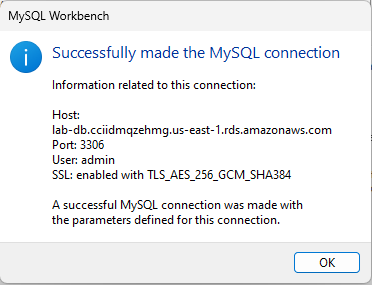

# Documentación del proyecto

## Índice

- [Documentación del proyecto](#documentación-del-proyecto)
  - [Índice](#índice)
  - [Miembros del equipo](#miembros-del-equipo)
  - [Introducción](#introducción)
  - [Entorno de desarrollo](#entorno-de-desarrollo)
  - [Base de datos](#base-de-datos)
  - [PHP](#php)
    - [.ENV](#env)
    - [Librerías](#librerías)
      - [Spatie](#spatie)
      - [Sanctum](#sanctum)
      - [Swagger](#swagger)
    - [Modelos](#modelos)
    - [Controladores](#controladores)
  - [JavaScript](#javascript)
  - [Bootstrap y CSS](#bootstrap-y-css)
    - [Paleta de colores](#paleta-de-colores)
    - [Diseño](#diseño)
    - [Uso de Bootstrap](#uso-de-bootstrap)
      - [Componentes utilizados](#componentes-utilizados)
        - [Breadcrumb (Migas de pan)](#breadcrumb-migas-de-pan)
        - [Buttons (Botones)](#buttons-botones)
        - [Cards (Tarjetas)](#cards-tarjetas)
        - [Navbar (Barra de navegación)](#navbar-barra-de-navegación)
        - [Modals (Modales)](#modals-modales)
        - [Pagination (Paginación)](#pagination-paginación)
        - [Carousel (Carrusel)](#carousel-carrusel)
        - [Accordion (Acordeón)](#accordion-acordeón)
    - [Responsividad](#responsividad)
    - [Accesibilidad](#accesibilidad)
    - [Animaciones](#animaciones)
  - [Despliegue de la aplicación](#despliegue-de-la-aplicación)
    - [AWS](#aws)
      - [BACKEND:](#backend)
        - [Grupo de Seguridad de la base de datos](#grupo-de-seguridad-de-la-base-de-datos)
        - [Zona de disponibilidad](#zona-de-disponibilidad)
        - [Grupo de Subredes RDS](#grupo-de-subredes-rds)
        - [Creación de la base de datos](#creación-de-la-base-de-datos)
        - [Ultimas modificaciones](#ultimas-modificaciones)
      - [FRONTEND:](#frontend)
        - [Creación de un bucket S3](#creación-de-un-bucket-s3)
    - [Instalación Apache2](#instalación-apache2)
      - [Comandos para la instalación de apache](#comandos-para-la-instalación-de-apache)
    - [Instalación de MySQL](#instalación-de-mysql)
        - [XAMPP](#xampp)
        - [MySQL Server](#mysql-server)
    - [Instalación de PHP y librerías](#instalación-de-php-y-librerías)
      - [Librerías y Dependencias para el Proyecto](#librerías-y-dependencias-para-el-proyecto)
        - [Dependencias de Producción (`require`)](#dependencias-de-producción-require)
        - [Dependencias de Desarrollo (`require-dev`)](#dependencias-de-desarrollo-require-dev)
  - [Instalación Completa](#instalación-completa)
      - [Configuración de PHP](#configuración-de-php)
    - [Habilitar PHP sobre Apache2](#habilitar-php-sobre-apache2)
    - [Instalar phpMyAdmin](#instalar-phpmyadmin)
    - [Instalar Composer](#instalar-composer)
    - [Instalar NodeJS](#instalar-nodejs)
  - [Documentación de código](#documentación-de-código)
    - [Generación de documentación](#generación-de-documentación)
      - [phpDocumentor](#phpdocumentor)
  - [Implementaciones faltantes](#implementaciones-faltantes)
  - [Mejoras o posibles cambios a futuro](#mejoras-o-posibles-cambios-a-futuro)
  - [Problemas encontrados](#problemas-encontrados)
  - [Bibliografía y Webgrafía](#bibliografía-y-webgrafía)
    - [Bibliografía](#bibliografía)
    - [Webgrafía](#webgrafía)

## Miembros del equipo

- [Pablo Mata](https://github.com/pmatag01)
- [Álvaro Berodia](https://github.com/Isalvan)
- [Rodrigo Ruiz](https://github.com/Rodroq)
- [David Llanillo](https://github.com/LLANNILLO)
- [Víctor Sánchez](https://github.com/victorllada)

## Introducción

Aplicación web para visualizar la celebración del torneo de fútbol solidario en Torrelavega.

Para la ejecución de este proyecto se plantea el uso de una arquitectura de tres capas.


Utilizaremos para el backend PHP (Laravel) para la creación de APIs y para el frontend React y Bootstrap.

## Entorno de desarrollo

Para el desarrollo de esta aplicación se ha utilizado como IDE el Visual Studio Code junto a las extensiones necesarias para cada lenguaje a utilizar y XAMPP cómo paquete de desarrollo que nos integra en un mismo software: Apache, MariaDB/MySQL y PHP. Todo ello bajo el sistema operativo Windows 11.

Para trabajar en equipo se han creado dos repositorios en GitHub, uno para el back y otro para el front, con los integrantes del grupo y se ha configurado el IDE en consecuencia. Además se ha llevado la estrategia de trabajar con issues dentro de cada proyecto y no trabajar directamente con la rama main del repositorio, en la que siempre estaría una versión 'estable' del proyecto.

Se han configurado varias máquinas virtuales:
* Máquina virtual Windows 11 para el desarrollo que contiene todo lo mencionado anteriormente.
* Máquina virtual en AWS para el despliegue de la aplicación.

Navegadores:
* Chrome
* Edge
* Mozilla Firefox

Otras herramientas utilizadas:
* Notepad++
* MySQL Workbench
* Postman

## Base de datos

Tendremos una base de datos llamada 'db_reto' con cotejamiento 'utf8mb4_unicode_ci'.

Almacenará los datos necesarios para gestionar la celebración del torneo de fútbol solidario en Torrelavega. Además de disponer de tablas de roles y permisos para los usuarios de la aplicación.

Todo lo relacionado con base de datos estará creado mediante PHP con migraciones para las tablas y factories y seeders para la inserción de datos. El diagrama de la base de datos es el siguiente:


## PHP

Para el apartado del backend hemos utilizado el lenguaje PHP 8.4.4 junto al framework Laravel 11.

### .ENV

En el archivo .env tendremos configuraciones de la aplicación como:

* Nombre de la aplicación.
* Parámetros de conexión a base de datos.
* Parámetros de configuración de envío de correo electrónico.

### Librerías

Para darle ciertas funcionalidades extras, más allá de las que proporciona el propio framework Laravel, hemos utilizado varias librerías.

#### Spatie

#### Sanctum

#### Swagger

### Modelos

Se han creado los modelos que reflejan las tablas de la base de datos.

### Controladores

Para manejar las solicitudes se han configurado rutas hacia los métodos del controlodor correspondiente.

## JavaScript

Para el apartado del frontend, hemos utilizado el lenguaje JavaScript con la librería React.

## Bootstrap y CSS

Hemos usado Bootstrap, ademas de CSS tradicional para cubrir ciertos aspectos que solo con Bootstrap no era posible.

### Paleta de colores


### Diseño

Para el diseño se han seguido las convenciones actuales en cuanto a distribución del contenido, con un menú principal en la parte superior de la pantalla y un pie de página. Dejando el contenido principal entre estos dos elementos.

### Uso de Bootstrap

Hemos usado Bootstap, aplicando componentes predefinidos y estilos para que concuerde con el diseño.

#### Componentes utilizados

* Breadcrumb (Migas de pan)
* Buttons (Botones)
* Cards (Tarjetas)
* Modals (Modales)
* Navbar (Barra de navegación)
* Pagination (Paginación)
* Carousel (Carrusel)
* Accordion (Acordeón)

##### Breadcrumb (Migas de pan)

Son usadas para informar al usuario en qué parte de la aplicación está situado, además puede usar lo puede usar para navegar por las distintas secciones.

##### Buttons (Botones)

Son utilizados para realizar acciones y/o confirmar cambios.

##### Cards (Tarjetas)

Utilizadas para mostrar diferentes apartados de información en la parte pública de la aplicación.

##### Navbar (Barra de navegación)

Usado en la cabecera de la página, contiene el logo con los distintos enlaces a las distintas páginas.

##### Modals (Modales)

Proporciona información al usuario antes de realizar acciones críticas, como borrado y modificación.

##### Pagination (Paginación)

Para mostrar registros paginados y evitar listados demasiados grandes en pantalla.

##### Carousel (Carrusel)

Para mostrar imágenes junto a texto con un efecto de desplazamiento lateral.

##### Accordion (Acordeón)

Utilizado para mostrar gran cantidad de información en pantalla, ocultándola en diferentes secciones que se pueden desplegar y/o ocultar.

### Responsividad

Gracias al uso de Bootstrap la aplicación se adaptará a los diferentes tamaños de pantallas y dispositivos.

### Accesibilidad

Hemos aplicado el uso de tooltips para proporcionar más información al usuario, además de el uso de colores llamativos como el rojo para botones que realizan acciones críticas como un borrado y actualizado de datos.

### Animaciones

Las animaciones se han aplicado al logo principal de la barra de navegación mediante el uso de keyframes haciendo que cuando se ha 'hover' sobre el logo rebote como un balón. También se tienen carruseles con imágenes de avance automático y manual. Además se han creado animaciones de 'pulso' para ciertos botones y otras de 'aparacer' que hace que ciertos elementos aparezcan en pantalla desde una ubicación concreta. Por otro lado, se ha creado un aumento en la escala de ciertos elementos que reciben el foco del ratón.
Se ha añadido un typing en la portada que hace que al cargarse se escriba el nombre de la liga y el cursor se quede parpadeando.

## Despliegue de la aplicación

La aplicación se desplegará de la siguiente forma:

### AWS
Para la instalación en AWS, configuramos los siguientes apartados:

#### BACKEND:
* ##### VPC
  Los ajustes con los cuales hemos configurado la VPC han sido los siguientes:
  * Nombre: proyecto-vpc
  * CIDR: 10.0.0.0/16
  * Zona de disponibilidad: us-east-1
  * Red Pública: 10.0.0.0/24
  * Subred privada: 10.0.1.0/24
  * GateAway: Ninguna
* ##### Grupo de Seguridad
  * Nombre: GrupoSeguridadEquipoReto1
  * VPC : VPC creada en el paso anterior
  * Reglas de Entrada:
    * HTTP: Protocolo TCP y puerto 80
    * SSH: Protocolo TCP y puerto 22
* ##### Máquina virtual(EC2)
  * Nombre: ServidorWebEquipo1
  * Servidor: Ubuntu Server 24.04 LTS
  * Tipo de instancia: T2 medium
  * Par de claves: vockey
  * VPC : Le asignamos la ya creada
  * Subred : Le asignamos los subnet que tiene asociada la VPC de nuestro proyecto
  * Asignación automática de IP Pública : Habilitar
  * Grupo de Seguridad : El creado previamente
##### Grupo de Seguridad de la base de datos
  * Nombre: GrupoSeguridadDB
  * VPC : La del proyecto 
  * Reglas de Entrada:
    * MYSQL/Aurora: Protocolo TCP , Puerto 3306 y cuyo origen va a ser el grupo de seguridad
    

##### Zona de disponibilidad
  Para la creación de la nueva zona de disponibilidad lo que haremos será crear dos nuevas subredes una pública y otra privada.
  * Subred Pública: 10.0.3.0/24
  * Subred Privada: 10.0.2.0/24
##### Grupo de Subredes RDS
  * Nombre: gruposubredesdb
  * VPC : La que creamos anteriormente
  * Zona de disponibilidad: us-east-1a y us-east-1b
  * Bloque CIDR: 10.0.0.0/16
  * Bloque de CIDR de la subred: Añadimos dos subredes, la sunet con el bloque CIDR 10.0.1.0/24 y la subnet con el bloque CIDR 10.0.3.0/24
##### Creación de la base de datos
  * Nombre: database-1
  * Metodo de creación: Estandar
  * Opciones del motor: MySQL
  * Plantillas: Producción
  * Disponibilidad y durabilidad: instancia de base de datos Multi-AZ.
  * Configuración:
    * Identificador de la instancia: lab-db 
    * Nombre de usuario maestro: admin
    * Administrador de credenciales: Autoadministrado
    * Contraseña maestra: La definida por el equipo
  * Configuración de la instancia:
    * Clases con ráfagas(incluye clases t) y seleccionamos db.t3.micro
  * Almacenamiento:
    * Tipo de almacenamiento: SSD de uso general(gp3)
    * Almacenamiento asignado: 20
  * Conectividad : 
    * VPC: La creada anteriormente
    * Grupo de Subredes: El creado anteriormente para la base de datos
    * Acceso público: Si
    * Grupo de seguridad de VPC(firewall): Seleccionaremos la opción de crear nuevo, y en nuestro caso lo hemos nombrado como grupoAccesoExteriorBD.
  
##### Ultimas modificaciones
  * grupoAccesoExteriorBD: Añadimos una nueva regla de entrada para que se permita la conexión desde cualquier ip por el puerto 3306 para esto configuraremos el tipo de origen como Anywhere-IPv4
  * Grupo de Subredes: El siguiente paso que hemos realizado fue dirigirnos a la esta sección para entrar en el grupo de subredes creado anteriormente, en el cual entraremos en cada una de las subredes de este grupo para acceder a la tabla de enrutamiento y dentro de estas tablas en la sección rutas las hemos editado añadiendo una nueva ruta en cada una de las subredes con acceso a internet.

      
    
  
  * Comprobación del correcto funcionamiento de la BD

    
  

#### FRONTEND:
##### Creación de un bucket S3
  * Nombre: equipo1retobucket
  * Bloquear todo el acceso publico: Desactivado
  * Alojmiento de sitios web esáticos: Habilitado
    * Documento de Índice: index.html
    * Documento de error: index.html
  * Subida de datos:
  Tras realizar un npm run build en el proyecto en react, se nos creará una carpeta **dist**, de la cual obtendremos todos los archivos que hay que cargar en el bucket.
  * Comprobación de funcionamiento: Una vez realizados todos los pasos, introduciremos en el navegador el Punto de enlace de sitio web del bucket
    

### Instalación Apache2
A continuación mostraremos los comando que hemos utilizado tanto para la instalación de apache como para la puesta en marcha de la Instancia para poder Correr el backend del proyecto:
#### Comandos para la instalación de apache
```bash
#Instalar apache
sudo apt install apache2

#Creación de la carpeta donde guardaremos el proyecto
mkdir var/www/html/www.reto1.es/public_html

#Dar permisos y cambiar la propiedad al usuario de apache
sudo chown -R www-data:www-data /var/www/html/www.reto1.es/public_html/Equipo1RetoBackend

#Establecemos los permisos adecuados
sudo chmod -R 755 /var/www/html/www.reto1.es/public_html/Equipo1RetoBackend

#Creación de los archivos para los sitios virtuales
sudo cp /etc/apache2/sites-available/000-dafault.conf /etc/apache2/sites-available/equipo1.es.conf

#Creación de un directorio para los ficheros de log
sudo mkdir -p ${APACHE_LOG_DIR}/sitios/empleados.es

#Configuración del archivo para el host virtual, donde configuraremos en el DocumentRoot  la ruta de la carpeta public de nuestro proyecto
sudo nano /etc/apache2/sites-available/equipo1.es.conf

#Activación del host mediante los siguientes comandos:
sudo a2dissite 000-default.conf
sudo a2ensite equipo1.es.conf
sudo systemctl restart apache2
```
### Instalación de MySQL
Para la instalación de MySQL se puede hacer de dos formas:

##### XAMPP
1. **Descarga XAMPP**  
   - Visita la página oficial de [Apache Friends](https://www.apachefriends.org/index.html).  
   - Selecciona la versión compatible con tu sistema operativo (Windows, Linux, macOS).  

2. **Ejecuta el instalador**  
   - Descarga el archivo ejecutable (`.exe` para Windows, por ejemplo) y ábrelo.  
   - Durante el proceso, se te pedirá seleccionar componentes. Asegúrate de marcar **MySQL** (o MariaDB) para incluirlo en la instalación.  

3. **Configura el entorno**  
   - Una vez instalado, abre el **XAMPP Control Panel**.  
   - Inicia el módulo de MySQL haciendo clic en "Start" junto a su nombre. Si se pone en verde, está funcionando.  

4. **Accede a MySQL**  
   - Abre un navegador y escribe `http://localhost/phpmyadmin` para acceder a phpMyAdmin, una interfaz gráfica que te permite gestionar la base de datos.  
   - Usa el usuario predeterminado `root` (sin contraseña inicial, aunque se recomienda establecer una).  

##### MySQL Server
1. **Descarga MySQL**  
   - Ve al sitio oficial de [MySQL](https://dev.mysql.com/downloads/mysql/).  
   - Selecciona **MySQL Community Server** y descarga el instalador para tu sistema operativo (por ejemplo, `.msi` para Windows).  

2. **Ejecuta el instalador**  
   - Abre el archivo descargado y sigue el asistente de instalación.  
   - Elige el tipo de instalación:  
     - **Developer Default**: Incluye herramientas para desarrolladores.  
     - **Server Only**: Solo el servidor MySQL.  
     - **Custom**: Personaliza los componentes.  

3. **Configura el servidor**  
   - Define la contraseña para el usuario `root`.  
   - Selecciona el puerto (por defecto, 3306) y otras opciones como el modo de autenticación.  

4. **Verifica la instalación**  
   - Abre una terminal (en Windows, usa el "Command Prompt" o "PowerShell").  
   - Ejecuta `mysql -u root -p` y escribe la contraseña para conectarte.  

5. **Instalación de Herramientas**  
   - Descarga e instala **MySQL Workbench** desde el mismo sitio para gestionar bases de datos con una interfaz gráfica.

### Instalación de PHP y librerías
Al igual que otras instalaciónes que hemos realizado, PHP lo hemos instalado mediante chocolatery
```bash
#Comando de instalación de PHP
choco install php
```
#### Librerías y Dependencias para el Proyecto

A continuación, se listan las librerías utilizadas en el proyecto, junto con los comandos para instalarlas mediante Composer y una breve descripción de su propósito.

##### Dependencias de Producción (`require`)

Estas son las librerías necesarias para el funcionamiento del proyecto en producción:
```bash
#darkaonline/l5-swagger  
##Integra Swagger en Laravel para generar documentación automática de APIs RESTful.  
composer require darkaonline/l5-swagger  

#laravel/framework  
##Núcleo de Laravel, proporciona las funcionalidades principales del framework como rutas, controladores, modelos y más.  
composer require laravel/framework  

#laravel/sanctum  
##Proporciona autenticación basada en tokens para APIs y aplicaciones SPA (Single Page Applications).  
composer require laravel/sanctum  

#laravel/tinker  
##Herramienta interactiva de línea de comandos para experimentar con el código de Laravel en tiempo real.  
composer require laravel/tinker  

#spatie/laravel-medialibrary  
##Facilita la gestión de archivos multimedia asociados a modelos (como imágenes o PDFs) en Laravel.  
composer require spatie/laravel-medialibrary  

#spatie/laravel-permission  
##Sistema de gestión de roles y permisos para controlar el acceso en aplicaciones Laravel.  
composer require spatie/laravel-permission  

#spatie/laravel-sluggable  
##Genera slugs (URLs amigables) automáticamente a partir de campos como títulos o nombres.  
composer require spatie/laravel-sluggable  

#zircote/swagger-php  
##Biblioteca base para generar especificaciones Swagger en PHP, complementa l5-swagger.  
composer require zircote/swagger-php  
```

##### Dependencias de Desarrollo (`require-dev`)

Estas librerías son útiles durante el desarrollo y pruebas, pero no son necesarias en producción:

```bash
#fakerphp/faker  
##Genera datos falsos (nombres, correos, etc.) para pruebas y llenado de bases de datos.  
composer require --dev fakerphp/faker  

#laravel/pail  
##Herramienta para inspeccionar y depurar logs de Laravel desde la línea de comandos.  
composer require --dev laravel/pail  

#laravel/pint  
##Linter y formateador de código para mantener un estilo consistente en el proyecto.  
composer require --dev laravel/pint  

#laravel/sail  
##Entorno de desarrollo basado en Docker para Laravel, simplifica la configuración local.  
composer require --dev laravel/sail  

#mockery/mockery  
##Biblioteca para crear mocks (objetos simulados) en pruebas unitarias.  
composer require --dev mockery/mockery  

#nunomaduro/collision  
##Mejora la experiencia de manejo de errores en la terminal durante el desarrollo y pruebas.  
composer require --dev nunomaduro/collision  

#phpunit/phpunit  
##Framework de pruebas unitarias para PHP, esencial para verificar el correcto funcionamiento del código.  
composer require --dev phpunit/phpunit
```
---

## Instalación Completa

Si deseas instalar todas las dependencias de una vez, usa:  
- Producción: `composer install`  
- Desarrollo: `composer install --dev`

Asegúrate de tener Composer configurado correctamente en tu entorno.

#### Configuración de PHP
Para la correcta configuración de PHP, hay que descomentar las siguientes lineas en el php.ini
```bash
extension=curl
extension=mbstring
extension=exif
extension=mysqli
extension=pdo_mysql
extension=zip
error_reporting=E_ALL & ~E_DEPRECATED & ~E_STRICT
display_errors=On
display_startup_errors=On

```
### Habilitar PHP sobre Apache2

```bash
#Instalación de PHP
sudo apt install php libapache2-mod-php php-mysql

#Lo siguiente, será modificar el php.ini, donde descomentaremos los errores y las extensiones de zip y curl ademas de otras que nos haran falta mas adelante para poder lanzar el proyecto como son mbstring o mysql
sudo nano /etc/php/8.3/apache2/php.ini

#Ademas, al igual que nos pasa con las extensiones mencionadas anteriormente, habra que instalar una extension de php llamada php-xml, sin este tipo de extensiones,cuando queramos realizar el composer update en el servidor nos saldrá un error, en el caso de esta extension nos aparecerá el error: - tijsverkoyen/css-to-inline-styles[2.2.5, ..., v2.3.0] require ext-dom * -> it is missing from your system. Install or enable PHP's dom extension..
sudo apt-get install php-xml

#Para comprobar que PHP ha sido instalado correctamente, crearemos un info.php en el public_html, dentro del cual introduciremos un codigo php para que nos muestre la información de PHP.CUIDADO, para mostrarlo habría que modificar el equipo1.es.conf y decirle que la ruta llega hasta public_html y no como ahora que llega a /public
sudo nano /var/www/html/www.reto1.es/public_html/info.php
```

### Instalar phpMyAdmin
Para la instalación de phpMyAdmin, tendríamos que dirigirnos al apartado [Instalación de MySQL](#instalación-de-mysql) y deberíamos seguir la opción de mysql con xampp. Una vez descargado xampp podemos acceder a phpMyAdmin introduciendo la siguiente url en el navegador `http://localhost/phpmyadmin` o podríamos dirigirnos al panel de control de xampp y seleccionar la opcion admin que aparece sobre mysql.
### Instalar Composer
Para la instalación de Composer, hemos utilizado la aplicación chocolatery, la cual nos hemos instalado seleccionando la opción de instalación de la misma cuando instalas NodeJS.

```bash
#Comando utilizando para la instalación de composer desde el power shell
choco install composer
```

### Instalar NodeJS

Para la instalación de NodeJS hemos seguido los siguientes pasos:
1. **Descarga el instalador**  
   - Visita la página oficial de [Node.js](https://nodejs.org/).  
   - Descarga la versión recomendada (LTS) haciendo clic en el botón "LTS" (por ejemplo, `node-v20.x.x-x64.msi`).  

2. **Ejecuta el instalador**  
   - Abre el archivo `.msi` descargado.  
   - Sigue el asistente de instalación:  
     - Acepta los términos de la licencia.  
     - Elige la carpeta de instalación (por defecto, `C:\Program Files\nodejs\`).  
     - Marca la opción para instalar **npm** (el gestor de paquetes de Node.js) automáticamente.
     - Añade la opción de instalar chocolatery, el cual hemos utilizado para otras instalaciones como composer.  

3. **Verifica la instalación**  
   - Abre una terminal (puedes usar "Command Prompt" o "PowerShell").  
   - Ejecuta:  
     ```bash
     #Comprueba la version del NodeJS instalado
     node -v
     ```

## Documentación de código

Para la documentación del código, clases, atributos o métodos, se han utilizado los estándares correspondientes a cada lenguaje.

### Generación de documentación

Se han generado páginas HTML estáticas con la documentación del código PHP y JS.

Para la generación de la documentación de PHP se ha utilizado la herramienta 'phpDocumentor' y para JS se ha utilizado 'JSDoc'.

#### phpDocumentor
Para la generación de la documentación con phpDocumentor, los pasos a seguir son los siguientes:

* Comenzamos pegando el archivo phar en la carpeta del proyecto, el cual encontraremos en la web de phpDocumentor

* El siguiente paso, será ejecutar el siguiente comando en la terminal, donde -d es el directorio del proyecto a documentar y -t es el directorio donde quieres generar la documentación
```bash
php .\phpDocumentor.phar run -d --ignore vendor/ -t 
```

## Implementaciones faltantes

## Mejoras o posibles cambios a futuro

* Personalizar Bootstrap, con el 'pero' que eso conlleva, para tener un diseño menos predefinido y estándar.
* Hacer mejoras de UX/UI, para hacer más cómodo el uso de la aplicación.

## Problemas encontrados

* Lentitud en los equipos del aula para realizar ciertas tareas con máquinas virtuales.
* La versión actual de TinyMCE no es compatible con React v19, por lo que como su uso era un requisito del proyecto se ha tenido que bajar a la versión de React v18.3.1.
* Falta de capacidad de diseño y personalización utilizando Bootstrap.
* Los monitores del aula, para al menos tareas de diseño, son demasiado pequeños.

## Bibliografía y Webgrafía

### Bibliografía

Se han utilizado los apuntes aportados durante el curso por los profesores y los que hemos ido generando nosotros mismos en base a los visto durante el curso.

### Webgrafía

* [Manual MySQL](https://dev.mysql.com/doc/refman/8.4/en/)
* [Manual PHP](https://www.php.net/manual/es/index.php)
* [Documentación Laravel 11](https://laravel.com/docs/11.x)
* [AWS](https://aws.amazon.com/es/)
* [Apache2](https://httpd.apache.org/docs/current/)
* [phpMyAdmin](https://docs.phpmyadmin.net/es/latest/)
* [Composer](https://getcomposer.org/)
* [NodeJS](https://nodejs.org/en)
* [phpDocumentor](https://docs.phpdoc.org/3.0/)
* [JSDoc](https://jsdoc.app/)
* [ChatGPT](https://chat.openai.com/auth/login)
* [GitHub Copilot](https://github.com/features/copilot)
* [Stack Overflow](https://stackoverflow.com/)
* [YouTube](https://www.youtube.com/)
* [Bootstrap](https://getbootstrap.com/)
* [React](https://es.react.dev/reference/react)
* [React Bootstrap](https://react-bootstrap.netlify.app/)
* [Swagger PHP](https://zircote.github.io/swagger-php/)
* [Laravel Sanctum](https://laravel.com/docs/11.x/sanctum)
* [Laravel Spatie](https://spatie.be/docs/laravel-permission/v6/introduction)
* [MDN](https://developer.mozilla.org/es/)
* [TinyMCE](https://www.tiny.cloud/)
